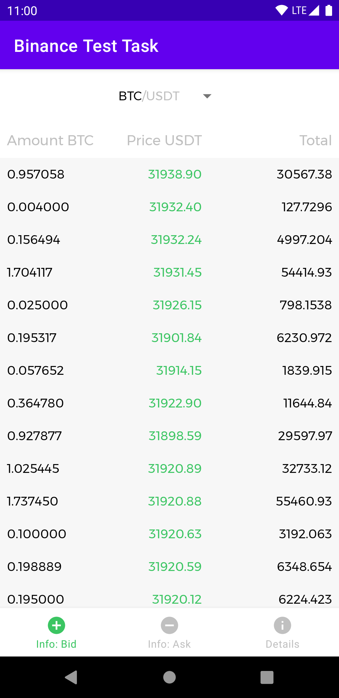
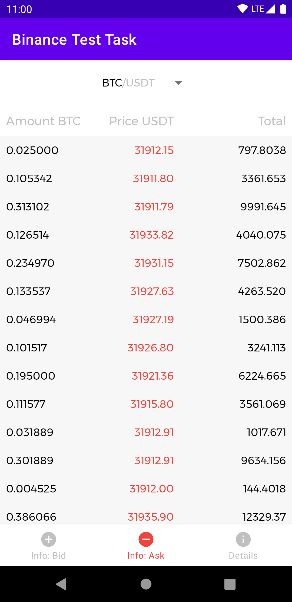
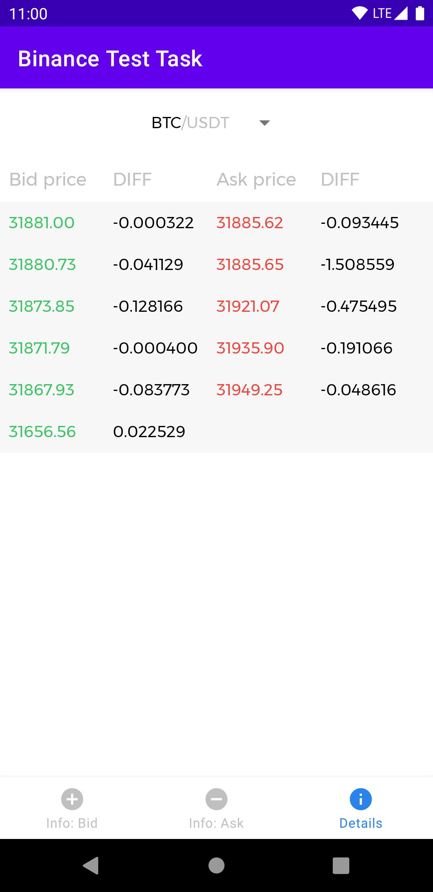

# Web socket sample app (Binance)

An app built just to try to make an app that uses web sockets 🤔

## Screenshots

Bid order book | Ask order book | Diff (bids & asks)
--- | --- | ---
  |  | 

## Built With

* MVVM & Clean Architecture
* [Kotlin](https://developer.android.com/kotlin) & [Flows](https://developer.android.com/kotlin/flow)
* [OkHttp](https://square.github.io/okhttp/) & [Moshi](https://github.com/square/moshi)
* [Dagger](https://dagger.dev/) & [Hilt](https://dagger.dev/hilt/)
* [Architecture Components](https://developer.android.com/topic/libraries/architecture) (LiveData, ViewModel)
* [JUnit](https://junit.org/junit4/) for testing

## Acknowledgements
The app uses [Binance API](https://github.com/binance/binance-spot-api-docs).
